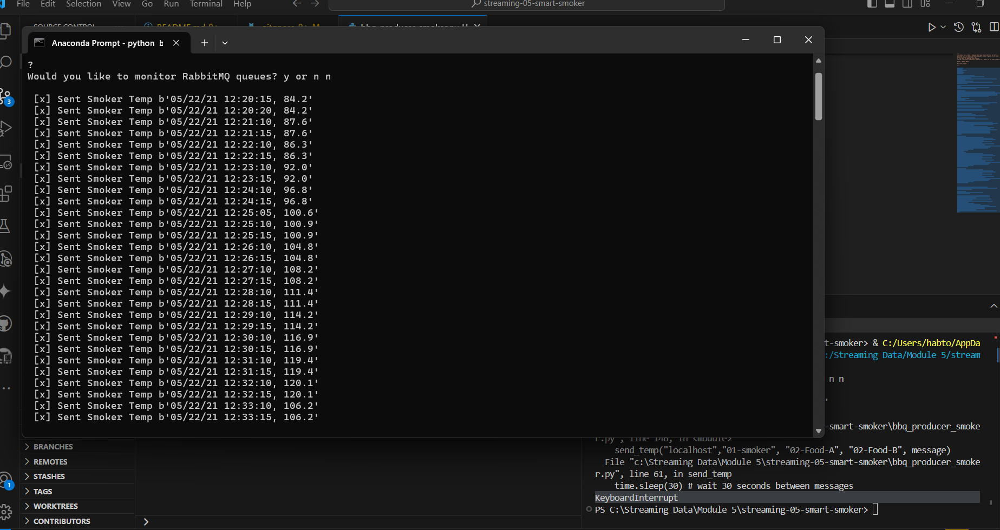
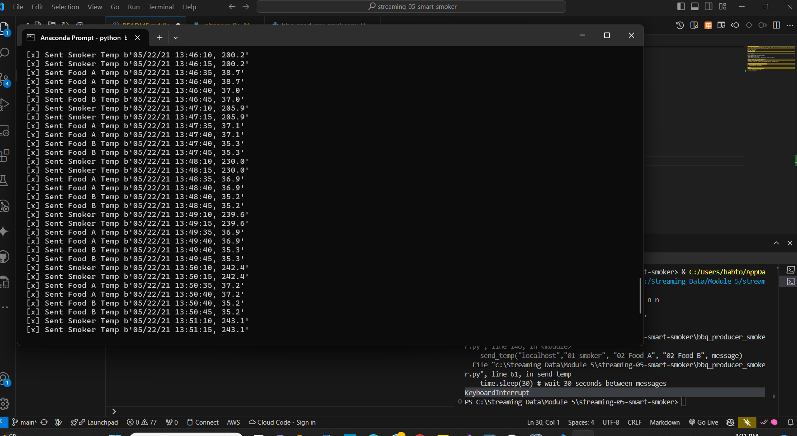
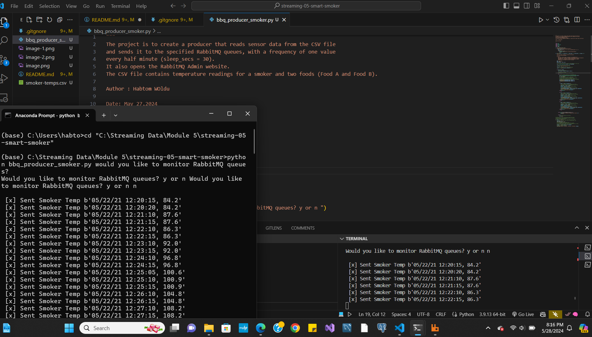

# streaming-05-smart-smoker

This project impelements a data prodcuer for streaming sensor data from a smart smoker system. The sensor data is stored in a CSV file, and the producer reads and sends it to RabbitMQ queues. 

Author: Habtom Woldu

Date: May 27,2024

# Getting Started 

Before you Begin

Enusre the following requirments are met:
. RabbitMQ server is running
. pika library is installed in the the acive Python environment.

# The key features of this project include:
. Reading sensor data from the CSV file:

. Sending data to RabbitMQ queues 

.Simulating sensor data streaming at a rate of one value every 30 seconds.

# How to use the producer, follow these steps:
1. Clone the repository to your local machine.
   
3. Make sure RabbitMQ is running.
   
5. Install pika ( pib install pika)

# Usage
1. Run the python file in the terminal 
2. python bbq_producer_smoker.py

